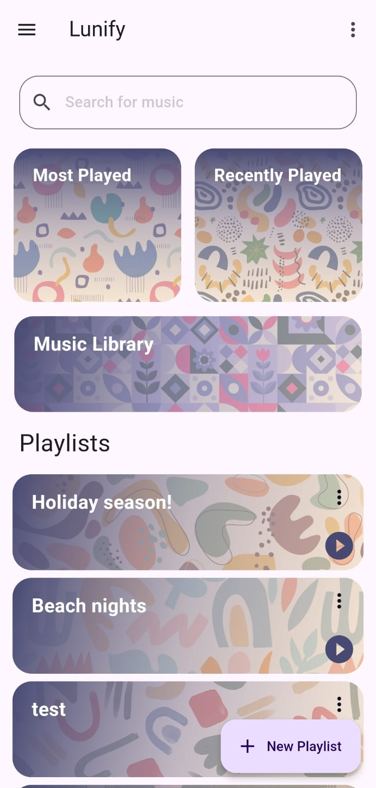
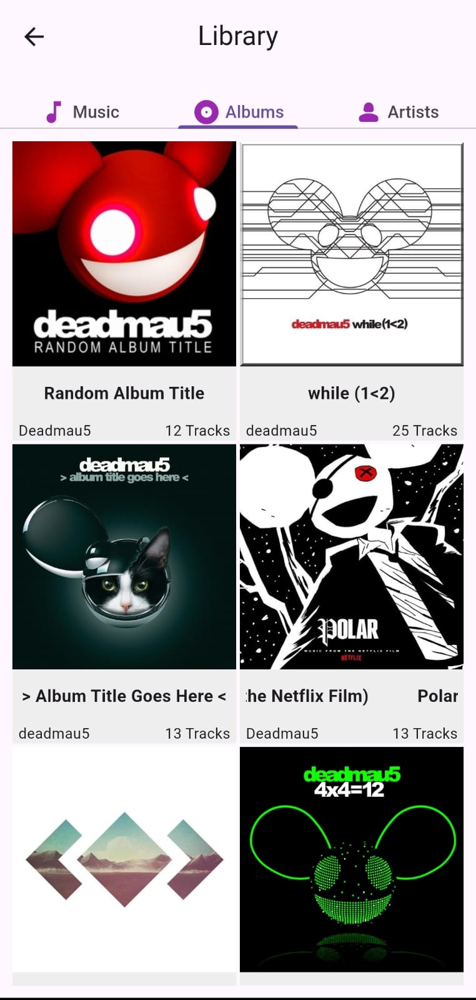
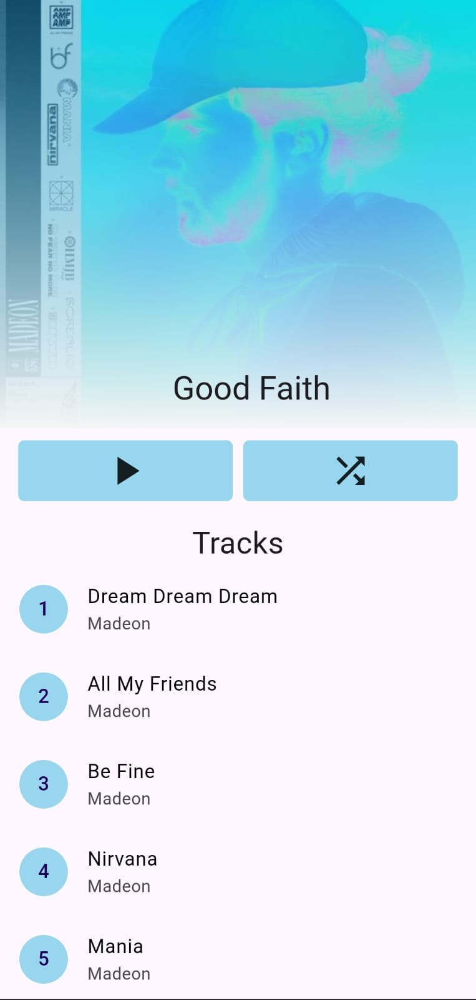

# Lunify
A sleek music player app built in Flutter, designed to illuminate your listening experience under the serene glow of the moon

  
  
  

## The Plan
This app is designed to be a feature-rich music player with an emphasis on an aesthetic and innovative UI/UX experience. Currently under development, the app aims to stand out with its unique design, novel features, and enhanced functionality, offering a superior and more engaging way to enjoy music.

## Contributing
We welcome contributions of all kinds! Whether you're fixing bugs, improving documentation, adding new features, or suggesting enhancements, your help is valuable. To get started, please fork the repository, make your changes, and submit a pull request. Be sure to review our contribution guidelines for more details. Thank you for helping us make this project better!

